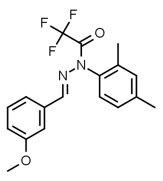
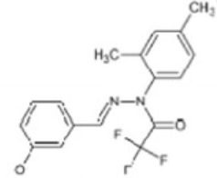

\centering

\raggedright

\clearpage

\tableofcontents

\newpage

# Intrdoduction
In this project we compared two different rna-seq datasets, both datasets came from studies that researched novel drugs for alzheimers disease(AD).
The two drugs of choice are called J147 and CAD31, the CAD-31 drug is a derivative of the J147 drug.
Their structures are shown below, we can see their structures are very similar weher the noticible difference lies in the second ring structure.

 
 
The organism used for this experiment are so called SAMP8 mice, this strain of mice exhibits a lot of the syptomes that a AD patient would.
The sequenced samples were taken from the hippocampal region in the brain. The J147 study had three groups, two old groups with alzheimers with one on and
the other group off the drug, and a young control group also with induced AD. The CAD-31 study consisted of four groups, two samp8 groups and two wild type(WT) groups. Each of these groups had mice on and off the drug. 


# Exploratory data analysis(EDA)

## Data preperation

### Downloading neccesary packages
```{r, message=FALSE, warning=FALSE}
library(affy)
library(scales)
library(DESeq2)
library(pheatmap)
library(PoiClaClu)
library(ggplot2)
library(edgeR)
library(EnhancedVolcano)
library(gplots)
library(SPIA)
library(dplyr)
```


### loading data into R


```{r}
#load in the data using the read.table method
j147 <- read.table("./data/j147.csv", header = T, sep = ",", quote="")
cad31 <- read.table("./data/cad-31.txt", header = T, sep = "\t", fill = T, quote="")

#create a new column for te gene annotation
cad31$Gene <- strsplit(cad31$Annotation.Divergence, "|", 1)

#filter the gene annotation out of the string
counter <- 1
while( counter < length(cad31$Gene)) {
  
  cad31$Gene[counter] <- cad31$Gene[[counter]][1]
  counter <- counter + 1
}

#drop some unnecesary columns
cad31 <- cad31[c(22, 9:21)]

#merge all the data into one dataframe
data <- merge(j147, cad31)

#replace na's with zero's
data[is.na(data)] <- 0

#rename the columns
names(data) <- c(
                paste0('Gene'),
                paste0('AD.old.j147.', 1:3),
                paste0('AD.old.', 1:3),
                paste0('AD.young.', 1:4),
                paste0('AD.cad31.', 1:3),
                paste0('AD.', 1:3),
                paste0('WT.CAD31.', 1:3),
                paste0('WT.', 1:4) 
                )

#set some indices to help future work
AD.old.j147 <- 2:4
AD.old <- 5:7
AD.young <- 8:11
AD.cad31 <- 12:14
AD <- 15:17
WT.CAD31 <- 18:20
WT <- 21:24
```

## Visualizations

### Basic statistics

```{r}
#Create summary's for all groups
summary(rowSums(data[AD.old.j147])/3)
summary(rowSums(data[AD.old])/3)
summary(rowSums(data[AD.young])/4)
summary(rowSums(data[AD.cad31])/3)
summary(rowSums(data[AD])/3)
summary(rowSums(data[WT.CAD31])/3)
summary(rowSums(data[WT])/4)
```
The min and first quantile all show similar or very similar results. The wildtype mouse shows the most expression with an almost double maximun than its drugged counterpart.

The young mouse and the mouse on CAD-31 have the least sequences read whereas the mouse with AD and on drugs seem to be upregulated.

This might be explained because of regulation but also the testing can have have a influence on the amount of sequences that are read, therefore we need to normalize the data.


### More preperation
Add 1 to the whole dataframe so it can logscale

```{r}
#set the gene column as row names
row.names(data) <- data$Gene
data[1] <- NULL

data <- data + 1
```


### Boxplot
```{r}
# set some colors to identify groups
myColors <- hue_pal()(7)

#create the boxplot
boxplot(log2(data),las=2, xlab = "sample mice",
        ylab = "log2 raw gene count", cex.axis=0.5,
        col=rep(myColors,c(3,3,4,3,3,3,4)))
title("Boxplot of read counts")
```
This boxplot shows the read counts for all groups on a log2 scale.
We see no outliers, this is a good sign and means we can continue.


### Density plot
```{r}
## Plot the log2-transformed data with a 0.1 pseudocount
plotDensity(log2(data + 0.1),
            col=rep(myColors,c(3,3,4,3,3,3,4)),
            lty=c(1:ncol(data)), xlab='Log2(count)',
            main='Expression Distribution')
legend('topright', names(data), lty=c(1:ncol(data)),
       col=rep(myColors,c(3,3,4,3,3,3,4)), cex = 0.3)
abline(v=1.5, lwd=1, col='red', lty=2)
```
In this density plot of the expression distribution we see two distinct peaks. The peak left of the dotted line is of little interest because we logscaled the data.
The second peak shows a lot of uniformity, exactly what we are looking for, the samples grouped together like this shows the number of reads compared over all the groups is very similar.
The height of the peak is of no interest.

### Barplot sequence depth
```{r}
barplot(colSums(data)/1000000,    col=rep(myColors,c(3,3,4,3,3,3,4)), 
        xlab = "mouse samples", ylab = "number of reads in millions", cex.names= 0.5, las=2)
title("Barplot of sequence depth")

abline(h = min(colSums((data)/1000000)), col = "red",
      lty=2, lwd=2)
```
This barplot shows us the number of reads (in millions) for each sample, an abline is drawn a the sample with the lowest read depth.
We can see that there is a more than two fold difference between samples, this isn't a huge problem it just means we have to normalize the data quite rigorously.


### Normalization

We first make a summerized experiment object using the deseq package.

```{r}
(ddsMat <- DESeqDataSetFromMatrix(countData = data,
                                  colData = data.frame(samples = names(data)),
                                  design = ~ 1))
```

After that we perform the actual normalization and extract its results.

```{r}
#Perform normalization
rld.dds <- vst(ddsMat)
#extract results
rld <- assay(rld.dds)
```

```{r, eval=FALSE}
j.av <- mean(rld[,1:10])
c.av <- mean(rld[,11:23])

j.bi <- mean(rld[,1:10]) +qt(c(0.025, 0.975), length(rld[,1:10])-1)*sd(rld[,1:10]/sqrt(length(rld[,1:10])))
 
c.bi <- mean(rld[,11:23]) +qt(c(0.025, 0.975), length(rld[,11:23])-1)*sd(rld[,11:23]/sqrt(length(rld[,11:23])))

#rld[,11:23] <-rld[,11:23]  * (c.av/j.av)

```


### Distance Calculation
Now the data has been normalized we can calculate the distance metrics for all possible combination of samples

```{r}
#Calculate the distances using the euclidean method
sampledist <- dist(t(rld), method = "euclidean", diag = T, upper = T)
#Convert the results to a matrix
sampledistmatrix <- as.matrix(sampledist)
```


### heatmap(both datasets)
```{r}
#Construction of annotation data
ann <- data.frame(group = factor(c(1,1,1,rep(2,each=7),3,3,3,4,4,4,5,5,5,6,6,6,6),
                                labels = c("AD.J147", "AD.CTRL", "AD.CAD31", "AD.CTRL","WT-CAD31", "WT")),
                  drug = factor(c(rep.int(1,3), rep.int(2,7), rep.int(1,3), rep.int(2,3), rep.int(1,3), rep.int(2,4)), labels = c("on drug", "off drug")),
                  study = factor(c(rep.int(1,10), rep.int(2,13)),
                                 labels = c("study j147", "study cad31")))
                  
row.names(ann) <- names(data)
#construct heatmap
pheatmap(sampledistmatrix, show_colnames = T,
         annotation_col = ann,
         clustering_distance_rows = sampledist,
         clustering_distance_cols = sampledist,
         main = "Euclidean Sample Distances")                  

```
In this heatmap the first thing that stands out is the big difference between the two studies, therefore we decided to also make two seperate heatmaps for each study.


### heatmap j147
```{r}
ann <- data.frame(group = factor(c(1,1,1,rep(2,each=3), rep(3, each=4)), labels = c("AD.old.J147", "AD.old", "AD.young")),
                  drug = factor(c(rep.int(1,3), rep.int(2,7)), labels = c("on drug", "off drug")))

row.names(ann) <- names(data[1:10])

sampledist <- dist(t(rld[,1:10]), method = "euclidean", diag = T, upper = T)
sampledistmatrix <- as.matrix(sampledist)

pheatmap(sampledistmatrix, show_colnames = T,
         annotation_col = ann,
         clustering_distance_rows = sampledist,
         clustering_distance_cols = sampledist,
         main = "Euclidean Sample Distances")   
```
This heatmap is much clearer, it shows a significant difference between the young and old mice.
This is not a suprise since age is the biggest risk factor for alzheimer's disease.
Further more we see the other two groups grouped together as well, although they don't show that much of a difference between eachother.
Notice that the scale is relatively small meanig that the differences are very distinct but not that big in literal terms.


### heatmap cad-31
```{r}
ann <- data.frame(group = factor(c(rep(1,each=3),rep(2,each=3), rep(3, each=3), rep(4,each=4)), labels = c("AD.CAD31", "AD.CTRL","WT-CAD31", "WT")),
                  drug = factor(c(rep.int(1,3), rep.int(2,3), rep.int(1,3), rep.int(2,4)), labels = c("on drug", "off drug")))

row.names(ann) <- names(data[11:23])

sampledist <- dist(t(rld[,11:23]), method = "euclidean", diag = T, upper = T)
sampledistmatrix <- as.matrix(sampledist)

pheatmap(sampledistmatrix, show_colnames = T,
         annotation_col = ann,
         clustering_distance_rows = sampledist,
         clustering_distance_cols = sampledist,
         main = "Euclidean Sample Distances")   


```
This heatmap of the CAD-31 drug is all over the place, we see an even smaller scale and on first sight no clear forming of groups.
But if we assume each group somehow has an outlier it all makes a lot more sense. Unfortunately we can't drop any samples since we at most only have in a group. 


### multi dimensional scaling plot 
```{r}
dds <- assay(ddsMat)
poisd <- PoissonDistance( t(dds), type = "deseq")
# Extract the matrix with distances
samplePoisDistMatrix <- as.matrix(poisd$dd)
# Calculate the MDS and get the X- and Y-coordinates
mdsPoisData <- data.frame( cmdscale(samplePoisDistMatrix) )

# And set some better readable names for the columns
names(mdsPoisData) <- c('x_coord', 'y_coord')
groups <- factor(c(1,1,1,rep(2,each=7),3,3,3,4,4,4,5,5,5,6,6,6,6),
                                labels = c("AD.J147", "AD.CTRL", "AD.CAD31", "AD.CTRL","WT-CAD31", "WT"))

coldata <- names(data)

# Create the plot using ggplot
ggplot(mdsPoisData, aes(x_coord, y_coord, color = groups, label = coldata)) + 
  geom_text(size = 4) +
  ggtitle('Multi Dimensional Scaling') +
  labs(x = "Poisson Distance", y = "Poisson Distance") +
  theme_bw()
```
The multi dimensional scaling plot shows the distance on a 2d surface. Here we again see a noticable difference between the two studies on the x-axis.
But in contrast to the heatmap of J147 we see a very clear grouping of the AD group on the J157 drug.
We also see that two of the three samp8 mice on CAD-31 reside on about the same y value as the AD mice on J147, suggesting similarity.
Furthermore in the CAD-31 study we see that mice on and off CAD-31 seem to cluster togehter a bit, but this can't be said with certainty.
Finally, appart from one outlier, we can see that in the J147 study the old and young AD mice show moderate but distinct difference in distance.


### conclusions EDA
The first thing that pops out when looking at the images created is that there are big differences between the two datasets.
This can be seen in the heatmap containing both studies and in the mds plot a well, This throws our comparison of gene 
expression a bit of, but it shouldn't be to big of a problem because we can just compare the DEG's later on.

A second thing that can be noticed in the heatmap of the j147 is that the age of the mouse seems of high influence on the 
gene expression but in the mds plot there also is a noticable difference between mice on and of the drug.

The cad-31 study seems to produce some more mixed results, altough harder to detect the same pattern as in the j147 seems
to apply.


# Discovering Differentialy Expressed Genes (DEGs)

## Pre-processing

### FPM normalization
```{r}
# Perform a naive FPM normalization
counts.fpm <- log2( (data / (colSums(data) / 1e6)) + 1 )

```

### 
```{r}
num.below.one <- 0
num.below.two <- 0

means <- rowMeans(counts.fpm)
difference <- c()

num.with.zero <- 0
num.with.one <- 0
num.with.zero.rows <- c()

i <- 1

while (i <= length(means)){
  if(means[i] < 1){
    num.below.one<- num.below.one+ 1
  }
  if(means[i] < 2){
    num.below.two <- num.below.two +1
  }
  j <- 1
  pass <- F
  
  while(j < length(counts.fpm[i,])){
    if(counts.fpm[i,j] < 1 & pass == F){
      num.with.zero <- num.with.zero +1
      pass <- T
      num.with.zero.rows <- append(num.with.zero.rows, i)
    }
    if(counts.fpm[i,j] < 2){
      num.with.one <- num.with.one +1
      j <- length(counts.fpm[i,])
    }
    j <- j+1
    
  }
  
  difference <- append(difference, max(counts.fpm[i,])-min(counts.fpm[i,]))
  
  i <- i+1}

means <- as.data.frame(means)
means <- cbind(means, difference)
means <- means[order(means[1]),]

plot(means$difference,type="h",xlab="number of genes", ylab="row means", col="darkseagreen1")
lines(means$means,type="l" ,col="blue",)
abline(v=num.below.one, col="red", lty=2)
abline(v=num.below.two, col="red", lty=2)
abline(v=num.with.zero, col="gold", lty=2)
abline(v=num.with.one, col="gold", lty=2)
```
The plot above describes the means of the rows in the normalized data. The abline's in red are values where the means are below 1 and two respectively and the yellow abline's rows that contain values below 1 and 2. The small difference between the abline's below 1 suggests that there isn't much of a difference between the values, the bigger gap between the values of two suggest the opposite.

The difference is seen in the light green histogram in the back, it first shows no difference relative to the means value, but as the mean gets bigger the difference also starts to increase and eventually kinda settles.

Therefore i decide to set the threshold of filtering where none of the values in the row is below one since after that threshold there seems to be a incline of the row means.
```{r}
original_length <- nrow(counts.fpm)
counts.fpm <- counts.fpm[-num.with.zero.rows,]
cat(original_length-nrow(counts.fpm), "rows are deleted")
```

## Fold Change Value
Next up we will calculate and plot the fold change values using the earlier calculated log2 values in the fpm variable.
The ablines on 1 and -1 indicate the threshold for significance.

### j47 old vs old
```{r}
two.groups <- as.data.frame(rowMeans(counts.fpm[AD.old.j147]))
two.groups["AD.old1"] <- rowMeans(counts.fpm[AD.old])
names(two.groups)[1] <- "AD.old.j147"

two.groups["difference"] <- two.groups$AD.old1 - two.groups$AD.old.j147

hist(two.groups$difference, breaks=60, main = "histogram of fold change difference", xlab="difference")
abline(v=-1, col="red")
abline(v=1, col="red")
```
Here we see minimal number of values that are significant.

### AD.cad31 vs AD
```{r}
two.groups <- as.data.frame(rowMeans(counts.fpm[AD.cad31]))
two.groups["AD"] <- rowMeans(counts.fpm[AD])
names(two.groups)[1] <- "AD.cad31"

two.groups["difference"] <- two.groups$AD - two.groups$AD.cad31

hist(two.groups$difference, breaks=60, main = "histogram of fold change difference", xlab = "difference")
abline(v=-1, col="red")
abline(v=1, col="red")
```
In this plot of CAD-31 we see some more values below -1, meaning that they are downregulated.

## Bio conductor
In this portion of the analysis we wil use bioconductor packages for further investigation, this means we will redo some of the previous steps such as normalization.
Originaly we wanted to work with DESeq only but edgeR gave us some better results, so we chose to continue on the edgeR package.
The analysis with DESeq is still kept in the logbook.

### design matrix
We first need to again construct a design matrix, similar to the one used with the heatmaps.
```{r}
group <- factor(c(1,1,1,rep(2,each=3),3,3,3,3,4,4,4,5,5,5,6,6,6,rep(7, each=4)),
                                labels = c("AD.J147", "AD.CTRL.OLD","AD.CTRL.YOUNG", "AD.CAD31", "AD.CTRL","WT-CAD31", "WT"))
(design <- model.matrix( ~ group))

```

We also reset the count data back to its original values since the packages handle normalization for us.
```{r}
data <- data -1
```

### DESeq2

```{r message=FALSE, warning=FALSE}
#Firtsly we make a DESeqdataset object
dq.dataset <- DESeqDataSetFromMatrix(data, as.data.frame(group), ~0+group)

#Now we fetch the results
result <- DESeq(dq.dataset)
DESeqResults.J147 <- results(result, contrast = c("group", "AD.CTRL.OLD", "AD.J147"),
               alpha = 0.05)
DESeqResults.CAD31 <- results(result, contrast = c("group", "AD.CTRL", "AD.CAD31"),
               alpha = 0.05)

DESeqResults.CTRL <- results(result, contrast = c("group", "AD.CTRL", "WT"),
               alpha = 0.05)

#printing the summary of results
print(summary(DESeqResults.J147))
print(summary(DESeqResults.CAD31))
print(summary(DESeqResults.CTRL))
```
These results are quite shocking, the percentage log fold changes and outliers are really low. 
This falls somewhat in line with the results we saw in the log fold change section.
These low results are the reason we reran the analysis in edgeR, hoping for better results.

```{r echo = FALSE}
DESeq2::plotMA(DESeqResults.J147, main="J147 VS AD.CTRL")
DESeq2::plotMA(DESeqResults.CAD31, main="CAD-31 VS AD.CTRL")
DESeq2::plotMA(DESeqResults.CTRL, main = "AD.CTRL(CAD-31 study) VS WT")
```
With these plots the lack of significant is underlined once again.
The blue dots represent significant values, in the plots with J147 and CAD-31 we hardly see any.
We threw in the AD control vs wildtype just for good measure, expecting a lot more significant values.
And yes we do see a lot more in the latter comparision.

### EdgeR

#### Construction of analysis function
```{r}
#function
get_deg <- function(data, group, design, title){
dl <- DGEList(as.matrix(data), lib.size = colSums(data), norm.factors = rep(1,ncol(data)), group = group)

dl <- calcNormFactors(dl)
plotMDS(dl, main = title)

ed <- estimateDisp(dl, design = design)
plotBCV(ed, main = title)

et <- exactTest(ed)

toptag<- topTags(et,n = 1000, p.value = 0.05)
return(toptag)
}
```


#### Subsetting data
```{r}
# Make the comparison data
J147.data <- data[1:6]
J147.group <-factor(c(1,1,1,rep(2,each=3)),
                                labels = c("AD.J147", "AD.CTRL.OLD"))
J147.design <- model.matrix( ~ J147.group)


cad31.AD.cad31.data <- data[11:16]
cad31.AD.cad31.group <-factor(c(1,1,1,rep(2,each=3)),
                                labels = c("AD.CAD31", "AD"))
cad31.AD.cad31.design <- model.matrix( ~ cad31.AD.cad31.group)


cad31.wt.cad31.data <- data[17:23]
cad31.wt.cad31.group <-factor(c(1,1,1,rep(2,each=4)),
                                labels = c("WT.CAD31", "WT"))
cad31.wt.cad31.design <- model.matrix( ~ cad31.wt.cad31.group)
```

#### Performing the analysis
```{r}
#do the analysis
j147.toptag <- get_deg(J147.data, J147.group, J147.design, "J147 VS AD.CTRL")
cad31.AD.cad31.toptag <- get_deg(cad31.AD.cad31.data, cad31.AD.cad31.group, cad31.AD.cad31.design, "CAD-31 VS AD.CTRL")
cad31.wt.cad31.toptag <- get_deg(cad31.wt.cad31.data, cad31.wt.cad31.group, cad31.wt.cad31.design, "AD.CTRL(CAD-31 study) VS WT")
```
##### J147 VS AD.CTRL
In the first plot of this comparison shows a clear difference between the samples where the mice on J147 seem to be upregulated versus the downregulated samp8 mice without medication.
The second BCV plot seems relatively normal.

##### CAD-31 VS AD.CTRL
In the fisrt dimensional plot of the second comparison of CAD-31 vs AD we see a very clear grouping of the CAD-31 samples, and the AD samples being somewhat more dispersed.
Here the BCV plot seems very similar to the first one all be it with slightly lower outliers.

##### AD.CTRL(CAD-31 study) VS WT
We once again added this comparison just to have a reference, we can see a grouping of wildtype in the first plot and the wildtype on CAD-31 seems to have one sample that is an outlier.
The BCV plot once again shows a very similar result, this is nice because it confirmes that the first two bcv plots show good results.


# Data Analysis and Visualization

## Volcano Plot
```{r}
EnhancedVolcano(j147.toptag$table,x = 'logFC', y = 'FDR', lab = rownames(j147.toptag$table), title = "J147 VS AD.CTRL")
EnhancedVolcano(cad31.AD.cad31.toptag$table,x = 'logFC', y = 'FDR', lab = rownames(cad31.AD.cad31.toptag$table), title = "CAD-31 VS AD.CTRL")
```
These volcano plots show which deg's are significant and if they're up- or downregulated. Red ones have a significant p-value and LFC.
The first J147 plot shows little significant deg's, all of which are upregulated.

The second CAD-31 plot has a lot more variables and really a lot more significant deg's, but the same trend of mostly upregulation is stil present.


## Venn diagram

```{r}
# Create a Venn-diagram given just the list of gene-names for both sets
venn(list("j147 vs AD.ctrl" = rownames(j147.toptag),
          "cad31 vs AD.CTRL" = rownames(cad31.AD.cad31.toptag)), )
```
Creating a venn diagram of all the deg's (not only the significant ones) results in seventeen shared deg's


## Signaling Pathway Impact Analysis

### Collecting deg's
First we write all the deg's to some files, we then change the gene annotation to entrez id's using an online tool on the DAVID website.

```{r}
degs <- c(rownames(j147.toptag), rownames(cad31.AD.cad31.toptag))
j147.degs <- rownames(j147.toptag)
cad31.degs <- rownames(cad31.AD.cad31.toptag)

# Write gene names to a file
write.table(degs, file = "edger-deg-names.txt",
            row.names = FALSE, quote = FALSE, col.names = FALSE)

write.table(j147.degs, file = "edger-j147deg-names.txt",
            row.names = FALSE, quote = FALSE, col.names = FALSE)

write.table(cad31.degs, file = "edger-cad31deg-names.txt",
            row.names = FALSE, quote = FALSE, col.names = FALSE)
```


### Data preperation
In this part we make a table with two columns: entrez ID and the corresponding LFC value.

```{r}
#read table of file downloaded from the david webside
j147.entrezid.gene <- read.table("j147_entrezid_gene.txt", header = T, sep = "\t")
#prep data in markdown for merge
j147.entrezid.gene.conversion <- as.data.frame(rownames(j147.entrezid.gene))
j147.entrezid.gene.conversion$entrez <- j147.entrezid.gene$From
colnames(j147.entrezid.gene.conversion)[1] <- "gene_name"

#Make a temperary tabkle containing the gene names
temp <- as.data.frame(rownames(j147.toptag$table))
temp$logFc <- j147.toptag$table$logFC
colnames(temp)[1] <- "gene_name"

#merge the data
j147.entrezid.logFC <- merge(j147.entrezid.gene.conversion, temp, by="gene_name")

j147.de <- c(j147.entrezid.logFC$logFc)
names(j147.de) <- c(j147.entrezid.logFC$entrez)

#Do the same for the CAD-31 data
cad31.entrezid.gene <- read.table("cad31_entrezid_gene.txt", header = T, sep = "\t", quote = "")
cad31.entrezid.gene.conversion <- as.data.frame(cad31.entrezid.gene$From)
cad31.entrezid.gene.conversion$entrez <- cad31.entrezid.gene$To
colnames(cad31.entrezid.gene.conversion)[1] <- "gene_name"

temp <- as.data.frame(rownames(cad31.AD.cad31.toptag$table))
temp$logFc <- cad31.AD.cad31.toptag$table$logFC
colnames(temp)[1] <- "gene_name"

cad31.entrezid.logFC <- merge(cad31.entrezid.gene.conversion, temp, by="gene_name")

cad31.de <- c(cad31.entrezid.logFC$logFc)
names(cad31.de) <- c(cad31.entrezid.logFC$entrez)

```

### Pathway analysis
```{r }
# Process all signaling pathways to see if they are inhibited or activated
j147.spia.result <- spia(de=j147.de, all=j147.entrezid.logFC$entrez, organism="mmu", plots=TRUE)
cad31.spia.result <- spia(de=cad31.de, all=cad31.entrezid.logFC$entrez, organism="mmu", plots=TRUE)
```
#### J147 pathway results
```{r}
j147.spia.result[1:5,]
```
Here we see the top five most impacted pathway's, very nice to see Alzheimer's disease on third place.
Confirming the effect of J147 on the disease.

#### CAD-31 pathway results
```{r}
cad31.spia.result[1:5,]
```
In the top five pathways's in of the cad-31 study Alzheimer's disease is not present, but it is further down the lis (39th) meaning significant alteration.
We do see Cholinergic synapse on number one, this pathway also plays a role in AD, thus also in this pathway analysis a lot of evidence for the drugs involvement in AD.

# Quick overview

Its hard to draw conclusions from the study, but the CAD-31 drug seems to affect a lot more genes than its counterpart.
Further experiments are needed to determine if these drugs are viable candidates to treat alzheimer disease. 
But so far they show promising results.
